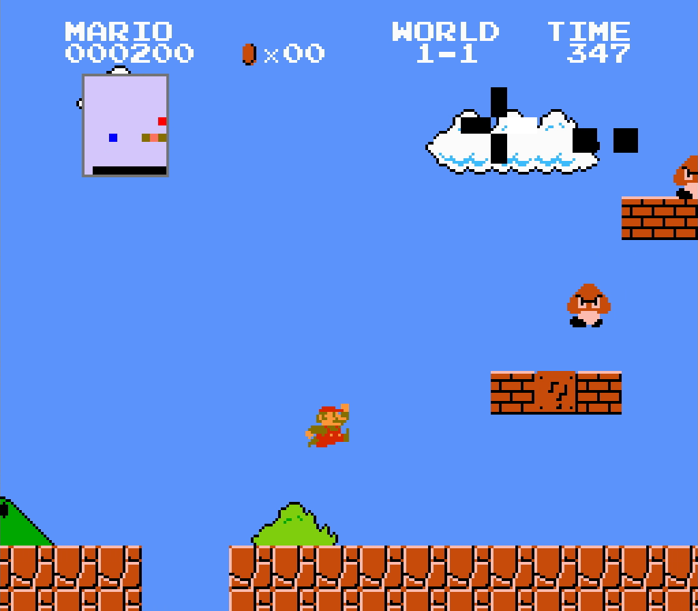

# Super Mario Bros Reinforcement Learning

## Setup

1. Download and install the emulator [FCEUX](https://github.com/TASEmulators/fceux) with `apt install fceux` (or download manually for your platform)
2. Clone this repository `git clone https://github.com/Accendit/smb-drf.git`
3. Build the Docker image `docker build -t smb ./`
4. Run the Docker image `docker run -p 6969:6969 smb`
5. Open the emulator and load the Super Mario Bros ROM (`File>Open Rom`)
6. Run the lua script client `file>load Lua Script` `browse` (select client/main.lua) then `start`